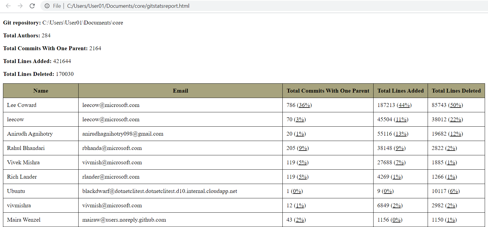

# Git Stats

Git Stats gives a quick overview of a Git repository: the total commits, total lines added, total lines removed, lines added by user, lines removed by user, etc.

## dotnet global tool 

The project is published at [NuGet](https://www.nuget.org/packages/GitStats/) as a global tool. To install and used it:

> dotnet tool install --global GitStats

> gitstats

## How to use it

> GitStats.exe -i [Git Repository Folder]

In order to generate an *html* or a *json* report:

> GitStats.exe -i [Git Repository Folder] -html -json

## Results

This results were obtained using the [dotnet/core](https://github.com/dotnet/core) repository as an example. 
The results were truncated and they were originally stored in separated files.

### JSON

```json
{
  "Authors": [
    {
      "Author": {
        "Name": "Immo Landwerth",
        "Email": "immol@microsoft.com",
        "LinesAdded": 1247,
        "LinesDeleted": 137,
        "TotalCommits": 29
      },
      "PercentageLinesAdded": 0,
      "PercentageLinesDeleted": 0,
      "PercentageTotalCommits": 1,
      "PonderatedPercentage": 0
    },
    {
      "Author": {
        "Name": "David Salgado",
        "Email": "davidsb@microsoft.com",
        "LinesAdded": 1,
        "LinesDeleted": 0,
        "TotalCommits": 1
      },
      "PercentageLinesAdded": 0,
      "PercentageLinesDeleted": 0,
      "PercentageTotalCommits": 0,
      "PonderatedPercentage": 0
    },
    {
      "Author": {
        "Name": "Rich Lander",
        "Email": "rlander@microsoft.com",
        "LinesAdded": 4269,
        "LinesDeleted": 1266,
        "TotalCommits": 119
      },
      "PercentageLinesAdded": 1,
      "PercentageLinesDeleted": 1,
      "PercentageTotalCommits": 6,
      "PonderatedPercentage": 3
    }
    ],
  "TotalLinesAdded": 421642,
  "TotalLinesDeleted": 170029,
  "TotalCommits": 2162,
  "GitRepositoryPath": "C:\\Users\\User01\\Documents\\core",
  "DigestDateUTC": "2021-01-30T15:17:15.7259911Z"
}
```

### HTML

